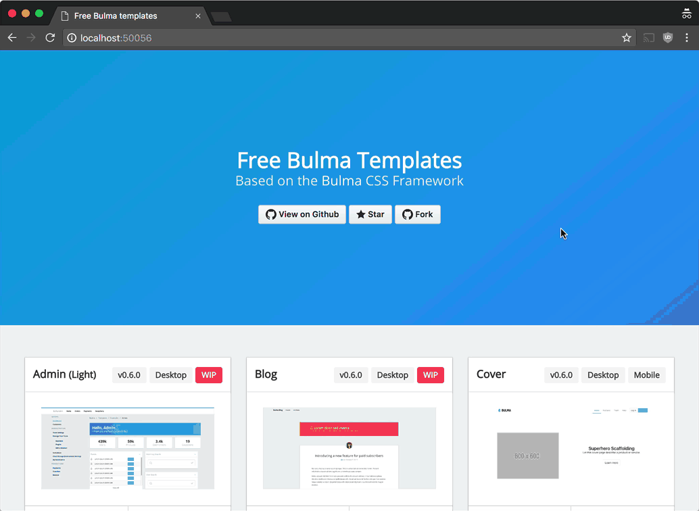

# Bulma Web Scaffold

> Free Pingy Web Scaffold for the Bulma CSS Framework Can be used to scaffold with CSS or SCSS.

**Templates are originally by @dansup. These templates are adapted for Pingy. You can find the original repo at https://github.com/dansup/bulma-templates**

## How to use it

1. Install Pingy if you haven't already (Requires [Pingy CLI](https://github.com/pingyhq/pingy-cli) 0.11 or later).

```
npm install @pingy/cli --global
```

2. Create a folder for the new site that you want to scaffold and `cd` into it.

```
mkdir mysite && cd mysite
```

3. Scaffold your site

```
pingy scaffold bulma
```

4. Pingy will open your web browser and allow you to scaffold the template you like. 👍



5. Go back to your terminal, confirm your scaffold and install.

```
? You are about to scaffold the following files

  mysite/
  ├─┬ styles/
  │ └── main.scss
  └── index.html

❯ Yes, go ahead
  No, but continue
  No and abort
```

6. Start up the pingy dev server and get to work. 💪

```
pingy dev
```

7. When you're happy that your site is just the right amount of awesome you can export it and it's ready to be uploaded wherever you like. ⚡️

```
pingy export
```
